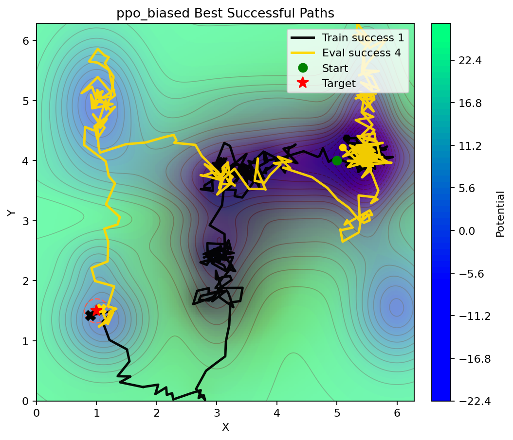

## PPO Agent for 2D Molecular Dynamics (CV1/CV2) + Analysis Pipeline
## Project Overview
This repository trains a PPO reinforcement learning agent to bias a molecular dynamics (MD) system using two collective variables (CV1 and CV2). The core training loop uses OpenMM to generate trajectories and a PPO policy to apply Gaussian biasing in CV space. The analysis suite then summarizes trajectories, computes free energy surfaces (FES), runs PCA, and provides a gap analysis toolkit for sparse regions and transition pathways.

Key capabilities:
- 2D CV tracking (distance-based CV1 and CV2) with per-episode DCD output.
- PPO training with checkpointing and per-episode bias and trajectory plots.
- Post-processing for CV trajectories, FES, and summary plots.
- PCA on MD trajectories with CV-to-PC correlation reporting and optional structure export.
- Gap analysis with density, speed spikes, and transition-path density overlays.

## Analysis Pipeline
### Trajectory Analysis
- Generate DCD trajectories during training (`main_2d.py` -> `combined_2d.py`).
- Post-process DCDs into CV time series, trajectory plots, and summary figures via `analysis/post_process.py`.
- Optional quick 2D path plot from DCDs with `scripts/plot_2d_path.py`.

### Free Energy Surface (FES)
- `analysis/cv2d_density.py` computes 2D probability and FES from CV1/CV2 arrays.
- Outputs include counts, probability, FES grids, and heatmaps with overlays.
- Optional MFEP extraction and gap masks (low probability or high FES regions).

### Collective Variables & Dimensionality Reduction
- CV1 and CV2 are distance-based and defined in `combined_2d.py` (training) and `config.py` (analysis).
- `analysis/pca_md.py` performs PCA on DCD trajectories (streamed with MDAnalysis).
- `analysis/pca_analysis.py` provides PCA on generic `.npy` arrays (frames x features).

### Gap Analysis
In this project, a "gap" means a sparsely sampled or underrepresented region in CV1/CV2 space relative to the rest of the trajectory data. Gaps usually appear as low-count or low-probability bins in the 2D density, or as high-FES regions that were rarely visited. These gaps flag regions where the policy has limited coverage, where barriers may exist, or where transition pathways are under-resolved.

<center> </center>

#### Density Approach (CV Density / FES Gaps)
**Logic**: build a 2D histogram over CV1/CV2, convert to probability, and optionally to FES; then mark bins that fall below a count/probability threshold or above an FES threshold.  

**Key variables**: binning (`bins`, `bin_width`, `bin_strategy`), physical scaling (`temperature`, `units`, `kT`), numerical stability (`pseudocount`, `epsilon`), and gap criteria (`min_count`, `gap_max_count`, `gap_max_prob`, `gap_min_fes`, `gap_percentile`, `gap_from`).  

**Why it helps and why applied**: density-based gaps are the most direct measure of sampling coverage. They highlight where trajectories have not spent time, and when overlaid with paths or MFEP, they show whether transitions are missing or poorly sampled. This approach is applied because it is robust, interpretable, and aligns with standard MD/FES diagnostics.

#### Speed Spikes Approach (CV Derivative Hotspots)
**Logic**: compute finite-difference derivatives of CV1 and CV2 versus time and analyze the speed magnitude $$\sqrt{\left(\frac{dCV1}{dt}\right)^{2} + \left(\frac{dCV2}{dt}\right)^{2}}.$$ Identify the top-N spikes and/or threshold-based spike regions on a CV grid.

**Key variables**: time handling (`time` array or `dt`), spike selection (`top_n`, `spike_percentile`, `spike_min_speed`), and spike binning (`spike_bins`, `spike_bin_width`, `spike_min_count`).

**Why it helps and why applied**: sharp speed spikes often correspond to barrier crossings, rapid rearrangements, or rare transition events that can be washed out in density plots. This approach helps isolate dynamic “hot corridors” even if they are low occupancy, which makes it complementary to density-based gaps.

#### Transition-Path Density Overlays (Basin-to-Basin Paths)
**Logic**: define basins (manual rectangles/polygons or automatic clustering), extract segments that transition between basins, then compute a density map of those transition segments and overlay it on the FES or CV density.  

**Key variables**: basin definition (`basin_method`, `basin_rect`, `basin_poly`), clustering (`cluster_method`, `dbscan_eps`, `dbscan_min_samples`, `gmm_components`, `gmm_cov`, `gmm_prob_threshold`, `cluster_scale`), transition extraction (`transition_mode`, `boundary_pad`), and density parameters (`bins`, `bin_width`, `trans_min_count`, `trans_alpha`).  

**Why it helps and why applied**: transition-path overlays focus on how the system moves between metastable basins rather than where it sits. This highlights preferred pathways, reveals under-sampled corridors, and helps diagnose whether the policy is finding the expected routes or getting stuck in off-path regions.

### Gap Analysis Toolkit
- `analysis/cv2d_density.py`: density/FES grids, gap masks, and overlay plots (trajectories, MFEP, annotated jumps/traps).
- `analysis/cv2d_speed.py`: derivative-based speed maps and spike reporting (top-N and thresholded regions).
- `analysis/cv2d_transitions.py`: basin discovery, transition segment extraction, and transition-path density overlays.
- Typical inputs: `analysis_runs/<timestamp>/data/cv1.npy`, `cv2.npy`, optional `time.npy`/`episode.npy`.
- Typical outputs: gap masks and FES overlays, spike tables/maps, and transition density plots saved under `results_PPO/analysis_runs/<timestamp>/figs/analysis/`.

## Repository Structure
### Directory Layout
```
project-root/
├── analysis/                 # Post-processing and analysis tools
├── scripts/                  # CLI wrappers for analysis utilities
├── results_PPO/              # Training and analysis outputs (created at runtime)
├── toppar/                   # CHARMM topology/parameter files
├── Archive/                  # Legacy sample project
├── combined_2d.py             # PPO agent + 2D CV environment
├── main_2d.py                 # Training entrypoint
├── config.py                  # Primary configuration for analysis
├── config_2d.py               # Legacy 2D config
├── step3_input.psf            # Topology (PSF)
├── traj_0.restart.pdb         # Starting structure (PDB)
├── toppar.str                 # Toppar list
└── *.py                       # Additional scripts and legacy utilities
```

### File Reference
| Python File | Path | Role | Library Dependencies | Internal Dependencies | Category | Has Output | Output Path |
|---|---|---|---|---|---|---|---|
| `main_2d.py` | `main_2d.py` | PPO training loop entrypoint (2D CV) | `numpy`, `torch`, `openmm`, `matplotlib` | `combined_2d` | Training | Yes | `results_PPO/` (DCDs, checkpoints, bias profiles, episode PDBs, trajectories) |
| `combined_2d.py` | `combined_2d.py` | PPO agent + 2D CV environment + plotting | `openmm`, `numpy`, `torch`, `matplotlib`, `tqdm`, `MDAnalysis` (optional) | None | Training/Core | Yes | `results_PPO/` subdirs (`dcd_trajs`, `full_trajectories`, `bias_profiles`, `episode_pdbs`, `checkpoints`, `episode_meta`, `coverage`) |
| `config.py` | `config.py` | Primary configuration (analysis + defaults) | `openmm` | None | Config | No | N/A |
| `config_2d.py` | `config_2d.py` | Legacy 2D config | `openmm` | None | Legacy/Config | No | N/A |
| `env_protein_2cv.py` | `env_protein_2cv.py` | Alternative 2CV environment | `openmm`, `numpy`, `tqdm` | `config` | Environment | Indirect | Caller-defined |
| `env_protein.py` | `env_protein.py` | Legacy 1CV environment | `openmm`, `numpy`, `tqdm` | `config` | Legacy/Environment | Indirect | Caller-defined |
| `util.py` | `util.py` | Utility math/FES helpers | `numpy`, `scipy`, `openmm`, `matplotlib` | `config` | Utilities | Indirect | Caller-defined |
| `dham.py` | `dham.py` | DHAM algorithm helpers (legacy) | `numpy` | `config` | Legacy/Analysis | No | N/A |
| `MSM.py` | `MSM.py` | Markov state model helpers (legacy) | `numpy` | `config` | Legacy/Analysis | No | N/A |
| `2D_opt_K.py` | `2D_opt_K.py` | Legacy tuning script | `numpy`, `scipy` | `config_2d` | Legacy/Analysis | Yes | Script-defined or CWD |
| `fit_dialanine_fourcos.py` | `fit_dialanine_fourcos.py` | Legacy FES fit (Fourier cosines) | `numpy`, `scipy`, `matplotlib` | `config_2d` | Legacy/Analysis | Yes | Script-defined or CWD |
| `fit_dialanine_gauss.py` | `fit_dialanine_gauss.py` | Legacy FES fit (Gaussian) | `numpy`, `scipy`, `matplotlib` | `config_2d` | Legacy/Analysis | Yes | Script-defined or CWD |
| `langevin_sim_unbiased.py` | `langevin_sim_unbiased.py` | Legacy 2D Langevin baseline | `openmm`, `numpy` | `util`, `config_2d` | Legacy/Simulation | Yes | Script-defined or CWD |
| `langevin_sim_metad.py` | `langevin_sim_metad.py` | Legacy 2D MetaD simulation | `openmm`, `numpy` | `util`, `config_2d` | Legacy/Simulation | Yes | Script-defined or CWD |
| `langevin_sim_mfpt_opt.py` | `langevin_sim_mfpt_opt.py` | Legacy MFPT optimization | `openmm`, `numpy` | `util`, `dham`, `config_2d` | Legacy/Simulation | Yes | Script-defined or CWD |
| `plain_multi_well_2D_fes.py` | `plain_multi_well_2D_fes.py` | Legacy FES generator | `numpy`, `matplotlib` | `config_2d` | Legacy/Analysis | Yes | Script-defined or CWD |
| `test.py` | `test.py` | Legacy test harness | `numpy` | `util` | Tests/Legacy | No | N/A |
| `test_util.py` | `test_util.py` | Legacy util tests | `numpy` | `util` | Tests/Legacy | No | N/A |
| `analysis/__init__.py` | `analysis/__init__.py` | Package marker | None | None | Analysis | No | N/A |
| `analysis/run_utils.py` | `analysis/run_utils.py` | Run directory helpers and metadata | None | `config` | Analysis/Utils | Yes | `results_PPO/analysis_runs/<timestamp>/run.json` |
| `analysis/post_process.py` | `analysis/post_process.py` | Post-process DCDs to plots and CSV | `numpy`, `matplotlib`, `MDAnalysis` (optional) | `analysis.run_utils`, `config` | Analysis | Yes | `results_PPO/analysis_runs/<timestamp>/figs/analysis/` and CSV in same folder |
| `analysis/pca_md.py` | `analysis/pca_md.py` | PCA on DCDs + CV correlation + optional structures | `numpy`, `matplotlib`, `MDAnalysis`, `scikit-learn` | `analysis.run_utils` | Analysis | Yes | `results_PPO/analysis_runs/<timestamp>/{data,figs/analysis,structures}` |
| `analysis/pca_analysis.py` | `analysis/pca_analysis.py` | PCA on `.npy` arrays (generic) | `numpy`, `matplotlib` | `analysis.run_utils` | Analysis | Yes | `results_PPO/analysis_runs/<timestamp>/{data,figs/analysis}` |
| `analysis/cv2d_density.py` | `analysis/cv2d_density.py` | 2D probability, FES, gap masks, MFEP | `numpy`, `matplotlib` | `analysis.run_utils` | Analysis | Yes | `results_PPO/analysis_runs/<timestamp>/{data,figs/analysis}` |
| `analysis/cv2d_speed.py` | `analysis/cv2d_speed.py` | CV derivatives and speed spikes | `numpy`, `matplotlib` | `analysis.run_utils` | Analysis | Yes | `results_PPO/analysis_runs/<timestamp>/{data,figs/analysis}` |
| `analysis/cv2d_transitions.py` | `analysis/cv2d_transitions.py` | Basin detection + transition density | `numpy`, `matplotlib`, `scikit-learn` | `analysis.run_utils` | Analysis | Yes | `results_PPO/analysis_runs/<timestamp>/{data,figs/analysis}` |
| `analysis/report_runs.py` | `analysis/report_runs.py` | Summarize analysis runs | `numpy` | `analysis.run_utils`, `config` | Analysis | Yes | `reports/<timestamp>/summary.md`, `reports/<timestamp>/runs.csv` |
| `scripts/post_process.py` | `scripts/post_process.py` | CLI wrapper for post-processing | None | `analysis.post_process` | Scripts | Yes | Same as `analysis/post_process.py` |
| `scripts/pca.py` | `scripts/pca.py` | CLI wrapper for PCA on DCDs | None | `analysis.pca_md` | Scripts | Yes | Same as `analysis/pca_md.py` |
| `scripts/cv2d_density.py` | `scripts/cv2d_density.py` | CLI wrapper for CV density/FES | None | `analysis.cv2d_density` | Scripts | Yes | Same as `analysis/cv2d_density.py` |
| `scripts/plot_2d_path.py` | `scripts/plot_2d_path.py` | Quick 2D CV path plot from DCDs | `numpy`, `matplotlib`, `MDAnalysis` | `config` | Scripts | Yes | `results_PPO/plots/2d_trajectory_path.png` (or `./plots`) |
| `scripts/cleanup_runs.py` | `scripts/cleanup_runs.py` | Remove empty analysis folders | None | `analysis.run_utils` | Scripts/Utils | No | N/A |

## Installation & Dependencies
- Python 3.9+ recommended.
- Core dependencies: `openmm`, `torch`, `numpy`, `matplotlib`, `tqdm`.
- Analysis dependencies: `MDAnalysis`, `scikit-learn`.
- Legacy utilities (optional): `scipy`.

If you use conda, OpenMM is typically easiest to install there. Use pip for the remaining packages.

## Usage & Execution
### Pipeline Overview
1. Configure CV atom indices and targets in `combined_2d.py` (training) and `config.py` (analysis).
2. Train PPO and generate DCDs and per-episode outputs.
3. Post-process trajectories to populate an analysis run.
4. Run PCA and gap analysis tools on the analysis run outputs.

### Step-by-Step Commands
```
# 1) Train PPO (writes to results_PPO/)
python main_2d.py

# 2) Post-process DCDs into a new or latest analysis run
python scripts/post_process.py --config-module combined_2d

# 3) PCA on multiple trajectories (writes data/figs/structures in analysis run)
python scripts/pca.py --max-traj 50 --write-structures --config-module combined_2d

# 4) Gap analysis toolkit (choose any subset)
python analysis/cv2d_density.py --run results_PPO/analysis_runs/<timestamp> --overlay-gap --overlay-traj
python analysis/cv2d_speed.py --run results_PPO/analysis_runs/<timestamp> --overlay-top-n --overlay-threshold
python analysis/cv2d_transitions.py --run results_PPO/analysis_runs/<timestamp> --per-episode
```

Additional cv2d_density examples (all supported patterns):
```
# Basic MFEP (auto start/end)
python analysis/cv2d_density.py --run results_PPO/analysis_runs/<timestamp> --mfep

# MFEP with explicit start/end in CV space
python analysis/cv2d_density.py --run results_PPO/analysis_runs/<timestamp> --mfep-start 3.2,4.1 --mfep-end 7.1,2.0

# Time-colored path with episode breaks, centroids, and ellipse
python analysis/cv2d_density.py --run results_PPO/analysis_runs/20260219-102118 --path-color time --path-break-episode --path-break-dcut 1.5 --episode-centroid --centroid-method mean --centroid-ellipse

# Trajectory line with jump/trap annotations
python analysis/cv2d_density.py --run results_PPO/analysis_runs/20260219-102118 --traj-line --annotate-jumps --annotate-traps --jump-labels --trap-labels

# Overlay gap + trajectory with legend and caption block
python analysis/cv2d_density.py --run results_PPO/analysis_runs/20260219-102118 --overlay-gap --overlay-traj --show-legend --caption
```

All available commands and CLI options (complete reference):
```
# Training (main entrypoint)
python main_2d.py

# Post-process (wrapper and direct)
python scripts/post_process.py --config-module combined_2d
python analysis/post_process.py --config-module <name> --run <dir> --runs-root <dir> --traj-glob "<glob>" --top <path> --max-traj-plots <int> --stride <int>

# PCA on DCD trajectories (wrapper and direct)
python scripts/pca.py --max-traj <int> --write-structures --config-module combined_2d
python analysis/pca_md.py --config-module <name> --top <path> --traj-glob "<glob>" --max-traj <int> --sample first|random --seed <int> --stride <int> --align-sel "<mda_sel>" --pca-sel "<mda_sel>" --pca-radius <float> --n-components <int> --batch-size <int> --bins <int> --kT <float> --run <dir> --runs-root <dir> --write-structures --max-structures <int> --ts-center <float> --ts-width <float> --bound-max <float> --unbound-min <float> --pc2-percentile <float> --atom1 <int> --atom2 <int> --atom3 <int> --atom4 <int>

# PCA on generic arrays
python analysis/pca_analysis.py --input <path.npy> --run <dir> --runs-root <dir> --bins <int> --kT <float> --dt-ps <float> --start-npy <path.npy> --target-npy <path.npy>

# CV density + FES + gap analysis
python scripts/cv2d_density.py  # wrapper
python analysis/cv2d_density.py --run <dir> --runs-root <dir> --cv1 <path.npy> --cv2 <path.npy> --csv <path.csv> --cv1-col <int> --cv2-col <int> --episode-col <int> --bins <int> --bin-width <float> --min-bins <int> --max-bins <int> --bin-strategy auto|fd|scott|sturges|sqrt --temperature <float> --units kcal|kJ --epsilon <float> --pseudocount <float> --min-count <int> --gap-max-count <int> --gap-max-prob <float> --gap-min-fes <float> --gap-percentile <float> --gap-from counts|prob|fes --overlay-traj --overlay-gap --fes-contours "<pcts>" --show-legend --caption --caption-fontsize <float> --absolute-fes --traj-size <float> --traj-alpha <float> --traj-line --traj-line-width <float> --traj-line-alpha <float> --path-plot --path-color <color|time> --path-cmap <cmap> --path-break-dcut <float> --path-break-episode --episode-centroid --centroid-method mean|median --centroid-ellipse --centroid-alpha <float> --centroid-color <color> --centroid-edge <color> --centroid-size <float> --centroid-arrow-color <color> --centroid-arrow-width <float> --centroid-arrow-scale <float> --mfep --mfep-start <cv1,cv2> --mfep-end <cv1,cv2> --mfep-diagonal --mfep-step-penalty <float> --mfep-nan-penalty <float> --mfep-color <color> --mfep-linewidth <float> --mfep-traj-alpha <float> --mfep-traj-size <float> --annotate-jumps --jump-percentile <float> --jump-min-delta <float> --jump-max <int> --jump-color <color> --jump-linewidth <float> --jump-labels --jump-label-size <float> --annotate-traps --trap-percentile <float> --trap-min-len <int> --trap-max <int> --trap-color <color> --trap-marker-size <float> --trap-labels --trap-label-size <float> --per-episode --no-pooled --max-episodes <int> --out-prefix <str> --config-module <name> --cv1-label <str> --cv2-label <str>

# CV speed analysis
python analysis/cv2d_speed.py --run <dir> --runs-root <dir> --cv1 <path.npy> --cv2 <path.npy> --time <path.npy> --csv <path.csv> --cv1-col <int> --cv2-col <int> --time-col <int> --dt <float> --time-units <str> --top-n <int> --point-size <float> --point-alpha <float> --cmap <name> --overlay-top-n --overlay-threshold --show-legend --caption --caption-fontsize <float> --spike-percentile <float> --spike-min-speed <float> --spike-bin-width <float> --spike-bins <int> --spike-min-count <int> --spike-fill-alpha <float> --top-marker-size <float> --out-prefix <str> --config-module <name> --cv1-label <str> --cv2-label <str>

# Transition-path density and basin extraction
python analysis/cv2d_transitions.py --run <dir> --runs-root <dir> --cv1 <path.npy> --cv2 <path.npy> --time <path.npy> --episode <path.npy> --csv <path.csv> --cv1-col <int> --cv2-col <int> --time-col <int> --episode-col <int> --basin-method auto|manual --basin-rect "name,xmin,xmax,ymin,ymax" --basin-poly <basins.json> --cluster-method dbscan|gmm --cluster-per-episode --cluster-scale none|zscore --dbscan-eps <float> --dbscan-min-samples <int> --gmm-components <int> --gmm-cov full|tied|diag|spherical --gmm-prob-threshold <float> --transition-mode outside|boundary --boundary-pad <int> --bins <int> --bin-width <float> --min-bins <int> --max-bins <int> --bin-strategy auto|fd|scott|sturges|sqrt --temperature <float> --units kcal|kJ --epsilon <float> --pseudocount <float> --min-count <int> --trans-min-count <int> --trans-alpha <float> --trans-overlay heatmap|contour --color-by time|episode --time-units <str> --point-size <float> --point-alpha <float> --per-episode --no-pooled --max-episodes <int> --out-prefix <str> --config-module <name> --cv1-label <str> --cv2-label <str>

# Analysis run summary
python analysis/report_runs.py --runs-root <dir> --out <path.md>

# Quick 2D CV path plot from DCDs
python scripts/plot_2d_path.py

# Cleanup empty analysis run dirs
python scripts/cleanup_runs.py

# Legacy scripts (run directly; no CLI flags)
python 2D_opt_K.py
python fit_dialanine_fourcos.py
python fit_dialanine_gauss.py
python langevin_sim_unbiased.py
python langevin_sim_metad.py
python langevin_sim_mfpt_opt.py
python plain_multi_well_2D_fes.py
```

## Outputs & Results
### Output Directory Structure
```
results_PPO/
├── dcd_trajs/                     # Per-episode DCD segments
├── full_trajectories/             # Per-episode CV1/CV2 plots and CSV
├── bias_profiles/                 # Per-episode bias profiles and timelines
├── episode_pdbs/                  # End-of-episode PDB snapshots
├── checkpoints/                   # PPO checkpoints
├── analysis_runs/<timestamp>/
│   ├── data/                      # NPY/CSV arrays (CVs, PCA, FES, spikes)
│   ├── figs/analysis/             # Analysis figures (FES, PCA, overlays)
│   ├── structures/                # Optional PDBs from PCA selection
│   └── run.json                   # Run metadata
├── plots/                         # Quick plots (ad hoc / helpers)
├── training_metrics.csv           # PPO metrics (if enabled)
└── episode_meta/                  # Optional episode metadata (if enabled)
```

### Output File Descriptions
| Output File | Produced By | Format | Description |
|---|---|---|---|
| `results_PPO/dcd_trajs/epXXXX_sYYY.dcd` | `combined_2d.py` | DCD | Per-episode MD trajectory segments (per RL action) |
| `results_PPO/full_trajectories/progressive_traj_ep_XXXX_cv1.png` | `combined_2d.py` | PNG | CV1 time series plot per episode |
| `results_PPO/full_trajectories/progressive_traj_ep_XXXX_cv1.csv` | `combined_2d.py` | CSV | CV1 time series (time_ps, cv1_distance_A) |
| `results_PPO/full_trajectories/progressive_traj_ep_XXXX_cv2.png` | `combined_2d.py` | PNG | CV2 time series plot per episode |
| `results_PPO/full_trajectories/progressive_traj_ep_XXXX_cv2.csv` | `combined_2d.py` | CSV | CV2 time series (time_ps, cv2_distance_A) |
| `results_PPO/bias_profiles/ep_XXXX_cv1_bias_profile.png` | `combined_2d.py` | PNG | CV1 bias profile (sum of Gaussians) |
| `results_PPO/bias_profiles/ep_XXXX_cv1_bias_profile.csv` | `combined_2d.py` | CSV | CV1 bias profile data |
| `results_PPO/bias_profiles/ep_XXXX_cv2_bias_profile.png` | `combined_2d.py` | PNG | CV2 bias profile (sum of Gaussians) |
| `results_PPO/bias_profiles/ep_XXXX_cv2_bias_profile.csv` | `combined_2d.py` | CSV | CV2 bias profile data |
| `results_PPO/episode_pdbs/ep_XXXX.pdb` | `combined_2d.py` | PDB | End-of-episode structure snapshot |
| `results_PPO/checkpoints/ckpt_ep_XXXX.pt` | `combined_2d.py` | PyTorch | PPO checkpoint (actor/critic + norm state) |
| `results_PPO/analysis_runs/<timestamp>/run.json` | `analysis.run_utils` | JSON | Run metadata and config snapshot |
| `results_PPO/analysis_runs/<timestamp>/data/cv1.npy` | `analysis/pca_md.py` | NPY | CV1 values aligned to PCA frames |
| `results_PPO/analysis_runs/<timestamp>/data/cv2.npy` | `analysis/pca_md.py` | NPY | CV2 values aligned to PCA frames |
| `results_PPO/analysis_runs/<timestamp>/data/pca_scores.npy` | `analysis/pca_md.py` | NPY | PCA scores for each frame |
| `results_PPO/analysis_runs/<timestamp>/data/pca_explained.npy` | `analysis/pca_md.py` | NPY | Explained variance ratios |
| `results_PPO/analysis_runs/<timestamp>/figs/analysis/pca_*.png` | `analysis/pca_md.py` | PNG | PCA plots (scree, cumulative, PC1/PC2, correlations) |
| `results_PPO/analysis_runs/<timestamp>/structures/*/*.pdb` | `analysis/pca_md.py` | PDB | Optional structure exports (TS, endpoints, PC2 extremes) |
| `results_PPO/analysis_runs/<timestamp>/data/cv2d_density_*` | `analysis/cv2d_density.py` | NPY | Counts, probability, FES, bin edges |
| `results_PPO/analysis_runs/<timestamp>/figs/analysis/cv2d_density_*.png` | `analysis/cv2d_density.py` | PNG | FES, overlays, MFEP, path plots |
| `results_PPO/analysis_runs/<timestamp>/data/cv2d_speed_*` | `analysis/cv2d_speed.py` | NPY/JSON/CSV | Speed arrays and spike tables |
| `results_PPO/analysis_runs/<timestamp>/figs/analysis/cv2d_speed_*.png` | `analysis/cv2d_speed.py` | PNG | Speed vs time and CV speed maps |
| `results_PPO/analysis_runs/<timestamp>/data/cv2d_transitions_*` | `analysis/cv2d_transitions.py` | NPY/CSV/JSON | Transition segments, basin metadata, density grids |
| `results_PPO/analysis_runs/<timestamp>/figs/analysis/cv2d_transitions_*.png` | `analysis/cv2d_transitions.py` | PNG | Transition density overlays |
| `results_PPO/plots/2d_trajectory_path.png` | `scripts/plot_2d_path.py` | PNG | Quick 2D CV path plot (time colored) |

## Examples & Tutorials
- Minimal end-to-end pipeline:
```
python main_2d.py
python scripts/post_process.py --config-module combined_2d
python scripts/pca.py --max-traj 50 --write-structures --config-module combined_2d
python analysis/cv2d_density.py --run results_PPO/analysis_runs/<timestamp> --overlay-gap --overlay-traj
```

- Quick 2D trajectory path from existing DCDs:
```
python scripts/plot_2d_path.py
```

- Summarize all analysis runs:
```
python analysis/report_runs.py
```
